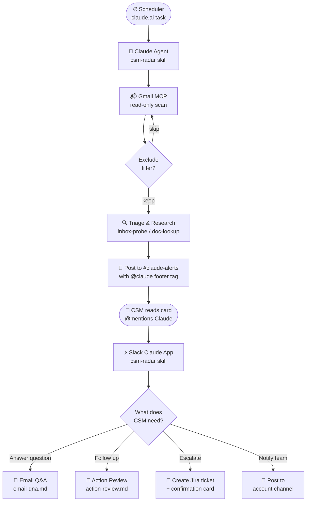

# CSM Radar

A [Claude Agent Skill](https://docs.anthropic.com/en/docs/agents-and-tools/agent-skills) for customer success workflows: inbox triage, email Q&A, action-card follow-up, Jira escalation, and Slack updates to internal account channels.

Two-part architecture: a **scheduled Claude agent** scans Gmail and posts alert cards to Slack; the **Slack Claude app** lets CSMs follow up in-thread.

## End-to-end workflow



### Part A — Scheduled agent (Claude.ai → Slack)

| Step | What happens |
|------|--------------|
| Scheduler | claude.ai fires the task, injects `<scheduled-task>` tag |
| Claude Agent | Loads csm-radar skill, picks **Inbox probe** mode |
| Gmail MCP | Scans inbox read-only; applies exclude filters |
| Exclude filter | Skips: Jira update emails, AIRIS quota alerts, Finance invoices, meeting invites |
| Triage & Research | Runs `inbox-probe.md` → `doc-lookup.md` → `client-ids.md` |
| Post to Slack | Formats via `alerts-post.md`, posts to `#claude-alerts` with `@claude` footer tag |

### Part B — Slack Claude app (CSM → Claude)

| Step | What happens |
|------|--------------|
| CSM @mentions Claude | Triggered by `@claude` in `#claude-alerts` or an account channel |
| Slack Claude App | Loads csm-radar skill, detects Slack context via footer tag |
| Mode picker | Branches based on what the CSM is asking |

| Mode | Use when | Reference |
|------|----------|-----------|
| **Email Q&A** | Answer a customer question, product behavior, talking points | `email-qna.md` |
| **Action review** | Follow up on one thread or action card | `action-review.md` |
| **Escalate** | Create Jira ticket or post to account channel (confirmation first) | `escalate.md` |

## Install

Copy this folder into your Claude skills directory (or add it as a project skill), then customize `references/profile.md` with your vendor, products, doc URLs, and team rules.

```
csm-radar/
├── SKILL.md              # Skill entry point and routing
├── README.md
├── assets/
│   └── ticket-template.md
└── references/
    ├── profile.md        # Start here — company-specific config
    ├── inbox-probe.md
    ├── email-qna.md
    ├── action-review.md
    ├── escalate.md
    ├── alerts-post.md
    ├── card-widget.md
    ├── doc-lookup.md
    ├── client-ids.md
    └── slack-channels.md
```

## Customization

Before use, edit these placeholders in `references/profile.md`:

- Company and product names
- Official documentation base URLs
- Account spreadsheet links (if used)
- Team triage rules (e.g. alerts to skip)

Add client IDs and Slack channel mappings in `references/client-ids.md` and `references/slack-channels.md`.

## Rules & constraints

- **Gmail is read-only** — no sending or scheduling email
- **Slack context** — source of truth is the Slack post only; no access to the original Gmail thread
- **Doc lookup** — technical/product claims must go through `references/doc-lookup.md`
- **No drafts by default** — no customer-ready email unless explicitly requested
- **Confirmation required** — no Jira ticket or Slack post without a confirmation card first
- **Reply threading** — drafts must use `threadId` so they stay in the original thread
- **Jira language** — all tickets must be written in English

## Repository

This is the **public, vendor-neutral** version of the skill. Internal URLs, client names, and channel IDs live in the reference files you configure locally — they are not committed with real customer data.

## License

Add your license here if you plan to share this publicly.
