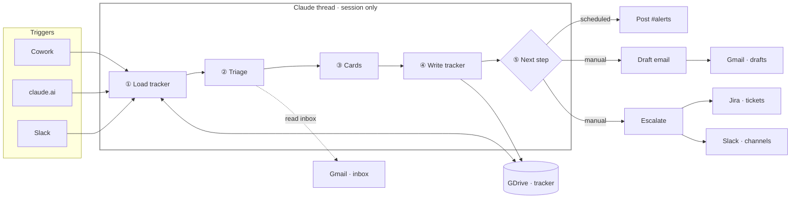
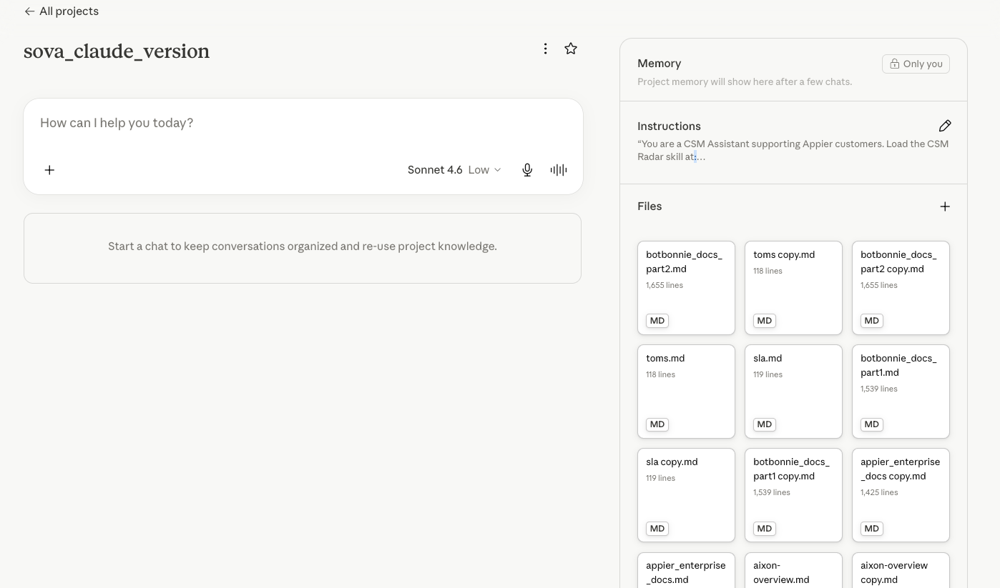
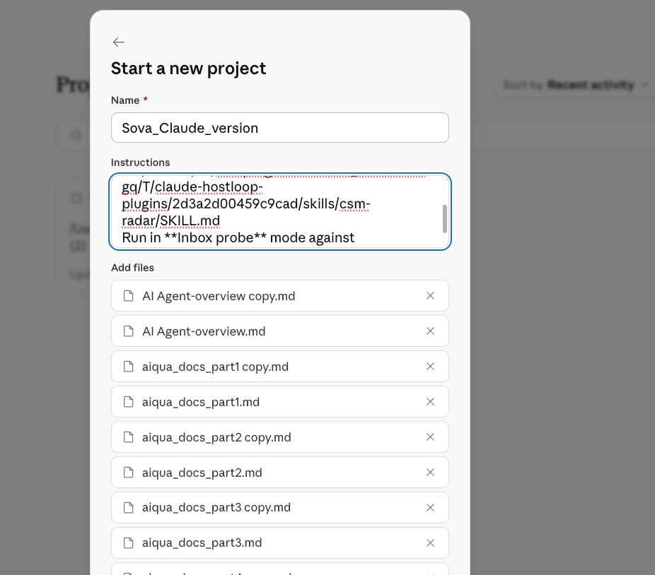
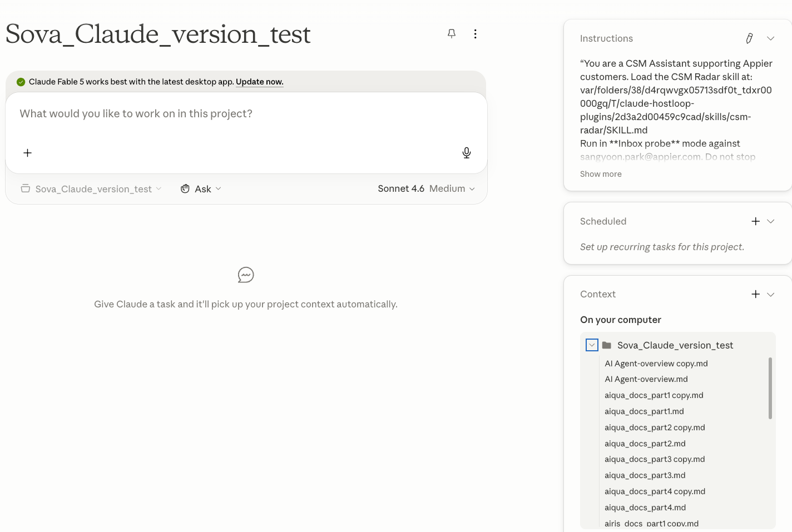

# CSM Radar — Setup Guide

*A Claude-powered inbox copilot for enterprise CSMs.*

---

## What it does

Enterprise CSM work runs on two repetitive loops:

1. **Technical / issue email** → triage → support handoff + Jira ticket + customer reply
2. **Request email** → requirement analysis → Slack share + stakeholder tag + Jira ticket

CSM Radar automates the mechanics of both. It runs on a schedule (e.g. every 4 hours, business
hours), builds interactive action cards in Claude, and pushes Slack alerts. You confirm before
anything gets filed or posted.

| Mode | Trigger | What happens |
|---|---|---|
| **Inbox Probe** | "Scan my inbox" / scheduled | Reads Gmail, triages new/changed threads, returns action cards |
| **Email Q&A** | Paste email + "how do I answer this?" | Researches product docs + web, gives grounded answer + optional draft |
| **Action Review** | "Follow up on the Acme thread" | Restores full thread history from memory, refreshes the card |
| **Escalate** | Card button or direct ask | Builds Jira ticket or Slack post → preview → confirm → done |

Escalate runs *after* the other three — card buttons hand off to it. It always previews before
filing.

---

## The research backbone — CSM Radar's "brain"

CSM Radar grounds every product or technical claim in your own documentation before acting. Think
of it as giving the agent a NotebookLM-style knowledge base plus the tools to draft replies,
raise Jira tickets, and post to account Slack channels.

The research backbone runs in two separate surfaces:

| Surface | How docs are searched | Notes |
|---|---|---|
| **Claude Cowork** (Claude Desktop) | Keyword search (`grep`) over path-loaded files | Less efficient than RAG; keep filenames aligned with `references/doc-lookup.md` |
| **Claude Chat** (claude.ai web) | Embedding-based RAG over Project knowledge | Same model as NotebookLM — faster, more accurate retrieval |

On both surfaces, CSM Radar also runs a targeted **web search** after doc lookup to confirm currency.
Without uploaded docs it falls back to web search only — slower and less precise.

> **Important:** Cowork and claude.ai web do **not** share Project knowledge or memory. Upload
> your product docs to **both** Projects separately, and update each when docs change.

---

## The card tracker — CSM Radar's memory

Every session (claude.ai, Cowork, Slack bot) starts with zero memory. What makes CSM Radar feel
continuous is one file: the **card tracker** (`card-tracker-*.md`) stored in your Google Drive.

**Every run loads the tracker first.** Whenever action cards are generated or refreshed, the
tracker is **written back immediately** — you do not need to escalate for the tracker to update.

**Don't hand-edit it. Don't delete the folder. It's the agent's brain.**

When using the Claude Slack bot, always start with `/csm-radar` — the bot has no memory of
your previous sessions, so that command tells it to load the skill and fetch the tracker.


## Architecture

**Claude thread** holds action cards and previews (session only — no cross-session memory).
**GDrive** holds the card tracker (persistent across runs). Gmail, Slack, and Jira are only
touched at the points shown below.

### Core path



### Scheduled vs manual

| Step | Scheduled (Cowork) | Manual (web / Slack) |
|---|---|---|
| ① Load tracker | Read card tracker from GDrive | Same |
| ② Triage | Inbox Probe — new cards or refresh from tracker | Inbox Probe · Email Q&A · Action Review |
| ③ Cards | Rendered in Claude thread only | Same |
| ④ Write tracker | Written to GDrive when cards update | Same |
| ⑤ Next step | Post summary to `#alerts` (always) | Draft outbound email and/or Escalate (optional) |

### Connector touchpoints

| System | When | What happens |
|---|---|---|
| **GDrive** | Start + after cards | Load tracker; write back on card update |
| **Gmail** | Triage + manual draft | Read inbox threads; create draft replies (`threadId`, never sent) |
| **Slack** | Scheduled end + manual escalate | `#alerts` summary (scheduled); account-channel posts (after confirm) |
| **Jira** | Manual escalate only | Create/update tickets after you confirm preview |
| **Claude thread** | Steps ①–⑤ | Cards, previews, and conversation — not persisted except via tracker |

**Also required:** Chrome connector on Claude Desktop (posts scheduled alerts via browser).

---

## Before you start

### 1. Get access to Claude

You need a **Claude Team or Pro plan** with sufficient token limits for inbox-probe runs.
Sign up or ask your admin at [claude.ai](https://claude.ai).

### 2. Download Claude Desktop

Download from [claude.ai/download](https://claude.ai/download). This is used for scheduled
runs — Claude Desktop's Cowork feature supports scheduling.

### 3. Connect four connectors

In Claude → Settings → Connectors, connect all four. Do the same in Claude Desktop → Customize → Connectors.

| Connector | Used for | Permissions |
|---|---|---|
| **Gmail** | Read inbox, create draft replies | Read + create drafts (no send, no delete) |
| **Google Drive** | Store/read the card tracker | Read + create files (no delete, no org-wide) |
| **Slack** | Post alerts + draft account-channel messages | Read + post/draft + lookup (no admin) |
| **Jira (Atlassian)** | Create/update escalation tickets | Read + create/edit issues (no admin) |

Leave permissions at the default settings the connector prompts suggest.

### 4. Connect Chrome on Claude Desktop

In Claude Desktop → Customize → Connectors, connect "Chrome" under Desktop. This lets CSM Radar
post Slack alerts as a browser action, which is more reliable than the Slack MCP bot token for
scheduled posts.

### 5. Enable the Claude Slack app + create an alerts channel

1. Enable the Claude app (bot) in your Slack workspace. Your Slack admin may need to approve it.
2. Create a **private channel** and invite **only the Claude app bot** (no human members).
   This is your alerts channel (e.g. `#csm-radar-alerts`). Scheduled summaries post here.

Note the channel name — you'll need it during setup.

### 6. Prepare your account details

Before running the wizard, gather:

- **Client/account names** and their product subscriptions
- **IDs per account, per environment (PRD and DEV):** Org ID, Project ID, App ID; secondary
  product (e.g. CDP) environment IDs; chat/bot product IDs
- **One internal Slack channel per account** (your team's account-specific channel)
- **Your working timezone** (e.g. UTC+9 for KST, UTC+8 for SGT)
- (Optional) **Account tracking spreadsheet URLs** if you keep per-account sheets

### 7. Prepare your product documentation (recommended)

CSM Radar verifies every product claim against your documentation. Without docs, it falls back
to web search — slower and less precise.

**How to get your docs into Markdown:**
Scrape your official documentation website into Markdown files. Use Claude Code or another AI
agent tool to crawl your docs site and output one `.md` file per major section. Re-run when
your docs change significantly.

**How to load them:**

- **Web (claude.ai):** add the Markdown files to your Claude Project knowledge (see Step 4 below).
- **Cowork (Claude Desktop):** place the files in a path-accessible location; update the
  `references/doc-lookup.md` filenames in the configured `csm-radar` skill if needed.

---

## Setup (step by step)

### Step 1 — Install the setup wizard

1. Download or clone this repo.
2. In Claude → Settings → Skills, upload the `sova-setup/` folder as a skill.
3. Start a new chat and say: **"Hey Claude — I just added the sova-setup skill."**

Claude drives the rest. It confirms your connectors, fetches your Jira cloud ID automatically,
creates your Drive folder, finds your Slack IDs, and builds your account roster from whatever
you paste or share. At the end it hands you a configured `csm-radar` zip with no placeholders.

You can delete the `sova-setup` skill afterwards.

### Step 2 — Install the configured csm-radar skill

Upload the `csm-radar` zip from the wizard in Claude → Settings → Skills. Do this for both
your web (claude.ai) install and your Claude Desktop install.

### Step 3 — Create a Claude Project

Create a Project in claude.ai. The system prompt can be minimal — the skill contains all the
instructions. For example:

```
You are a CSM assistant. Load the csm-radar skill and run in Inbox Probe mode
against [your-email@company.com]. Do not stop early.
```

> You need **two separate Projects**: one for web (interactive use) and one for Cowork
> (scheduled runs). Upload your product docs to each Project's knowledge separately.

### Step 4 — Upload product docs to both Projects

Upload your scraped Markdown documentation to **both** the web Project and the Cowork Project.
The two surfaces do not share files.

**Web (claude.ai)** — add docs via Project → Files:



**Cowork (Claude Desktop)** — add docs when creating the Project or via Project → Context:





### Step 5 — Set up scheduled runs (Claude Desktop)

Open Claude Desktop → your Cowork Project and tell Claude when to run. For example:

> "Set up a scheduled inbox probe every 4 hours on weekdays between 9 AM and 6 PM [your timezone]."

The Scheduled panel in your Cowork Project will show the recurring task once configured.

---

## Daily use

- **Scheduled run** → summary lands in your alerts channel. Skim the cards.
- **Claude Desktop** runs in the background. A spare machine works well for always-on scheduling.
- **In Slack** — @mention the Claude bot. Start fresh conversations with `/csm-radar` so the bot
  loads the skill and fetches the tracker before responding. The bot only remembers the current
  thread — not your claude.ai or Cowork sessions.
- **On the go** — reply to the Slack summary, or @mention the bot + `/csm-radar` to start fresh.
- **At the claude.ai console:**
  - `"follow up on card 3"` — refreshes a specific card
  - `"draft a reply"` — generates a draft (you review before sending)
  - `"create Jira + share to Slack"` → preview → confirm → done
  - `"mark card 4 resolved"` — keeps tomorrow's probe clean
  - `"ask Claude to update memory"` — fine-tunes triage (e.g. "exclude automated quota alerts",
    "exclude internal tooling update emails")

Gmail is read-only. All Jira and Slack actions need your confirmation. Your data stays in your
own connected accounts.

---

## Configuration reference

All `{{PLACEHOLDERS}}` in the skill files, filled by the wizard:

| Placeholder | File(s) | How to find |
|---|---|---|
| `{{YOUR_JIRA_CLOUD_ID}}` | `escalate.md`, `card-tracker.md` | `Atlassian:getAccessibleAtlassianResources` |
| `{{YOUR_JIRA_SITE}}` | `escalate.md`, `card-tracker.md` | Same tool — the `url` field |
| `{{CARD_TRACKER_FOLDER_ID}}` | `card-tracker.md`, `email-qna.md`, `action-review.md`, `escalate.md` | Google Drive folder URL → segment after `/folders/` |
| `{{YOUR_SLACK_WORKSPACE_ID}}` | `alerts-post.md` | `T…` in `app.slack.com/client/T…/C…` |
| `{{YOUR_ALERTS_CHANNEL_ID}}` | `alerts-post.md` | `C…` in the same URL |
| `{{YOUR_ALERTS_CHANNEL_NAME}}` | `alerts-post.md` | Channel name without `#` |
| `{{YOUR_TIMEZONE}}` / `{{YOUR_UTC_OFFSET}}` | `profile.md`, `alerts-post.md` | Your working timezone |
| `{{YOUR_JIRA_PROJECT_A}}` / `{{YOUR_JIRA_PROJECT_B}}` | `escalate.md` | `getVisibleJiraProjects` |
| `{{YOUR_FEATURE_REQUEST_FIELD_1}}` / `{{YOUR_FEATURE_REQUEST_FIELD_2}}` | `ticket-template.md` | `getJiraIssueTypeMetaWithFields` |

The account files (`client-ids.md`, `slack-channels.md`, `profile.md`) are rebuilt from your
roster by the wizard — they don't use token substitution, they're written fresh.

---

## Troubleshooting

**Probe crashes or cards are empty**
→ Check Gmail and Google Drive connectors. Verify `{{CARD_TRACKER_FOLDER_ID}}` is correct in `card-tracker.md`.

**Jira ticket creation fails**
→ Verify the Atlassian connector is active and `{{YOUR_JIRA_CLOUD_ID}}` is set in `escalate.md`.

**Slack summary not posting on scheduled runs**
→ Verify the Chrome connector is connected in Claude Desktop. Check workspace and channel IDs in `alerts-post.md`.

**Slack bot doesn't know about my previous conversations**
→ Expected — the bot has no cross-session memory. Always start with `/csm-radar` to load the skill and fetch the tracker.

**Product claims are wrong or outdated**
→ Re-scrape your documentation and replace the doc files in your Project knowledge (web) and Cowork Context (desktop).

**Cowork and web give different answers on the same question**
→ Expected — Cowork uses keyword search over local files; web uses RAG over Project knowledge. Keep both doc sets in sync.
